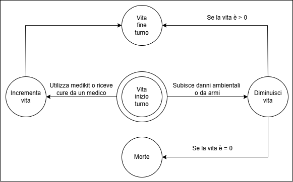

## Consegna esercizio

Ipotizzando un sistema di gioco con combattimento a turni, ipotizzare un personaggio utilizzando:
- 5 Attributi
- Definizioni degli Stati di quegli attributi
- 5 Azioni

## Svolgimento

### Personaggio
Soldato semplice della Seconda Guerra Mondiale.

### Attributi

#### Attributo 1: Vita
Contatore della vita residua del soldato.

---

#### Attributo 2: Posizione
Indica in che posizione si trova il soldato. Le posizioni permesse (cioè gli stati dell'attributo) sono:
- in piedi
- accovacciato
- steso

---

#### Attributo 3: Precisione
Indica la bravura del soldato nell'utilizzo delle armi da fuoco. Più è alta maggiori sono le probabilità di colpire i nemici.

---

#### Attributo 4: Resistenza fisica
Indica la capacità del soldato di sostenere determinati sforzi fisici. Alcune delle azioni hanno un costo in resistenza fisica che deve essere pagato affinché possano essere svolte.

---

#### Attributo 5: Protezione
Indica il livello di protezione del soldato. I due stati di protezione sono:
- protetto
- non protetto

Per proteggersi il soldato deve eseguire l'azione di schivata. Quando il soldato è protetto è più difficile per i nemici colpirlo.

---

### Azioni
Il soldato può eseguire nel proprio turno al massimo un'azione tra quelle elencate più l'azione di movimento.

#### Azione 1: Attacco con arma da fuoco
Il soldato effettua un attacco con l'arma da fuoco in dotazione.

#### Azione 2: Attacco con arma corpo a corpo
Il soldato effettua un attacco con l'arma corpo a corpo in dotazione.

#### Azione 3: Schivata
Il soldato sfrutta l'ambiente circostante, **se possibile**, per nascondersi e proteggersi dai colpi dei nemici.

#### Azione 4: Usa oggetto dall'inventario
Il soldato utilizza uno degli oggetti disponibili nel proprio inventario.

#### Azione 5: Movimento
Il soldato si muove verso un punto raggiungibile della mappa.